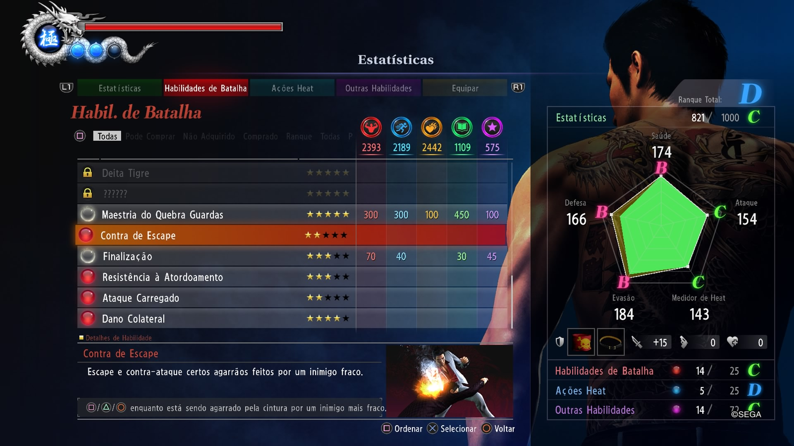
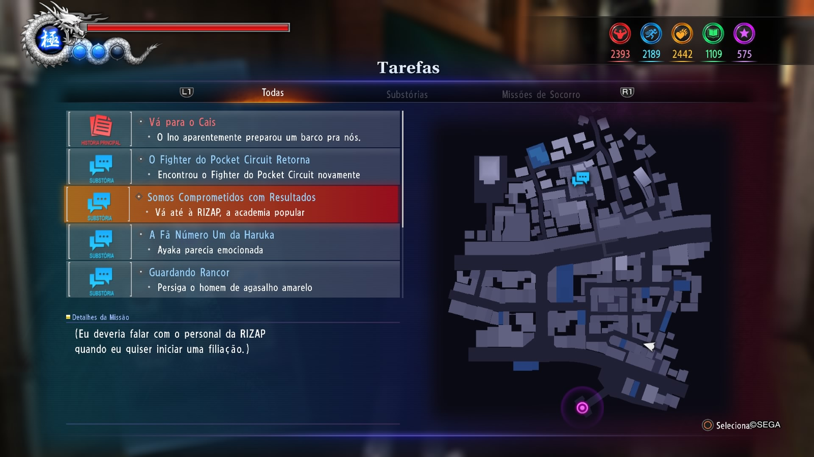
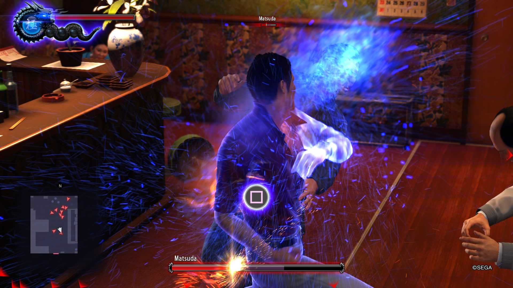
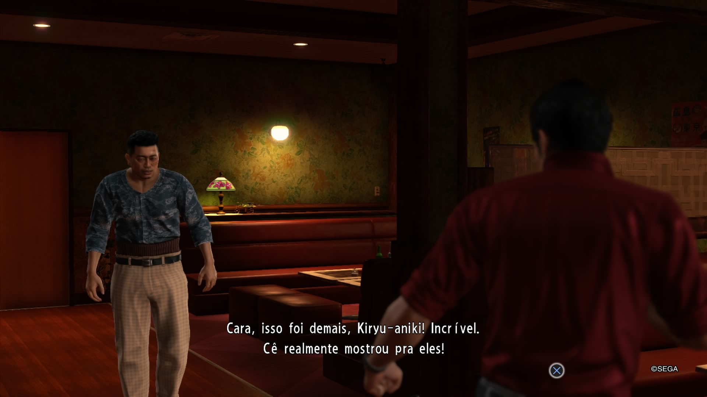

# Yakuza 6: The Song of Life – Tradução PT-BR (PS4)

Este projeto é um **port amador da tradução de PC para PS4** do jogo **Yakuza 6: The Song of Life**.

---

## 📌 Informações do jogo
- **Jogo:** Yakuza 6: The Song of Life
- **Plataforma:** PlayStation 4
- **CUSA:** CUSA09660
- **Versão do jogo:** Base
- **Conteúdo do patch:** Apenas tradução (não inclui atualização do jogo)

---

## 🌍 Créditos
- **Tradução original (PC):** Brazil Alliance  
- **Port para PS4:** szdtkk  

Todos os créditos da tradução pertencem exclusivamente ao grupo **Brazil Alliance**.  
Este projeto **não altera o conteúdo da tradução**, apenas adapta os arquivos para funcionamento no PS4.

---

## ⚠️ Avisos importantes
- Este é um **port amador**, feito por apenas uma pessoa.
- O port **não é 100% perfeito**.
- Em algumas situações, ao ser agarrado por inimigos, pode aparecer o botão **A (Xbox)** em vez do botão do PlayStation.
- Podem existir pequenos bugs visuais ou textos fora do padrão.
- Diferente do Kiwami 1 e Kiwami 2, **eu zerei este jogo utilizando este port**.

---

## 🎮 Estado atual
- Jogo **jogável do início ao fim**
- História principal com texto em português
- Cutscenes com legendas em português
- Substories traduzidas
- Port funcional, porém não totalmente perfeito

---

## 📸 Capturas de tela

---

## 📥 Download
👉 **Clique na aba Releases para baixar a tradução**
